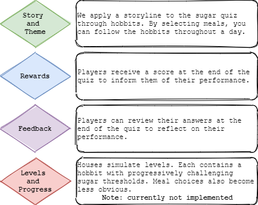

## 2 Background and Motivation
  * [2.1 An overview of the problem: background literature](README.md#21-an-overview-of-the-problem-background-literature)
  * [2.2 Identifying the cause: academic research](README.md#22-identifying-the-cause-academic-research)
  * [2.3 Tackling the problem: industry review](README.md#23-tackling-the-problem-industry-review)

### 2.1 An overview of the problem: background literature

Most adults and children in the UK consume too much sugar, and this poses significant health risks to the population as people are at greater risk of obesity, type 2 diabetes, heart disease, and tooth decay[[1]](README.md#references). Table 1 uses data from the NHS[[1]](README.md#references) and the National Diet and Nutrition Survey (NDNS)[[2]](README.md#references) to illustrate exactly how much excess sugar is consumed by people in the UK.

| Age Range | Recommended daily sugar allowance (grams) | Mean daily sugar intake (grams) between 2015-2016 | Difference between recommended intake and actual intake |
| :---: | :---: | :---: | :---: |
| 7 - 10 | 24 | 52.2 | +117.5% |
| 11 - 18 | 30 | 67.1 | +123.7% |
| 19 - 64 | 30 | 57.1 | +90.3% |

It is clear from the data that:
-	On average, each demographic consumes more than their recommended daily allowance.
-	The 11 – 18 age range consume the most excess sugar at roughly 2.2x their allowance.
-	All children and young adults consume over double their allowance.
-	Adults consume less excess sugar than other age groups but still a significant amount more than their recommended daily allowance.

Additional data from the NDNS shows that sugar consumption has decreased over time, roughly by 14.4% for 11 – 18 year olds and 7.6% for 19 – 64 year olds between 2008 and 2016. At this rate, however, it would take over fifty years for actual consumption levels to match those recommended by the NHS. Given the adverse health effects of excess sugar consumption, it is a serious issue, and accelerating the decrease in sugar intake would be greatly beneficial for the health of the population.

### 2.2 Identifying the cause: academic research

Understanding why people consume excessive amounts of sugar is crucial for addressing the behaviour. The main sources of sugar in people's diets are processed foods, such as cereals, confectionary, and non-alcoholic drinks[[3]](README.md#references). A lack of awareness surrounding the sugar content of these foods could lead to unintended sugar consumption. In one study[[4]](README.md#references) surveying over 2000 adults, participants are shown images of non-alcoholoic drinks and asked to estimate their sugar content. Juice and carbonated drinks contain similar amounts of sugar (approximately 26g/250ml), but particpants misjudge the content in each:

-	They underestimate the sugar content of fruit juices by 48%.
-	They overestimate the sugar content carbonated drinks by 12%.

Most participants are not aware that both drinks contain similar levels of sugar, and they perceive juice as a healthier alternative. 

If people were aware of the sugar content of soft drinks and other processed foods, they could make informed, healthier choices when deciding what to consume. To address this problem, we seek to raise awareness of excess sugar consumption by educating people on the sugar amount in food.

### 2.3 Tackling the problem: industry review

Institutions often influence the behaviour of large groups of people through ‘nudging’. This involves subtly changing one’s choice environment to alter their actions in a predictable way without forbidding any options[[5]](README.md#references). Nudging has already been applied to the UK food and drink sector in the form of nutrition labelling[[6]](README.md#references), where manufacturers are required to list an overview of the macronutrients present in processed food on their packaging. These labels make people aware of how much sugar is contained in the food, and enables them to make informed decisions without limiting their options. However, consumers still may not recognise the amount of sugar in products for two reasons:
  - The numerical representation of the amount of sugar in a product
  - The appearance of sugar content on the packaging
  
The sugar amounts presented on these labels (often in grams) do not translate into practical units of measurement such as teaspoons[[7]](README.md#references). Therefore, individuals may struggle to visualise how much sugar they are actually consuming. Also, nutrition labelling is mandatory and manufacturers do not have an incentive to educate the people purchasing their products. As a result, the labels are often in small print, and only those who are intentionally looking for it are likely to see it.

Purposely educating people about the sugar content of foods outside any purchasing environment may better raise awareness of sugar content. Several studies have been conducted about the use of serious games to educate and influence the eating habits of children and adults.

#### 'Quest for Lava Mountain'[[8]](README.md#references)

This first study was conducted on a sample of 94 children in fourth and fifth grade (44 in intervention group and 50 in comparison group). The intervention group play a resource-based RPG that shows players the nutritious value of healthy foods (‘Quest to Lava Mountain’) for an average of 4.6 hours across 6 weeks. The authors report a statistically significant decrease in sugar consumption across children in the intervention group compared with the comparison group. 

#### 'The Kingdom of Taste'[[9]](README.md#references)

This study randomised 14 families into two groups: a game-group and non-game-group. The game-group played a board game designed to spark interest in healthy meal composition (‘The Kingdom of Taste’) during a three-week intervention period. Each group took qualitative tests before and after the intervention period, and the authors recorded a significant positive change in food behaviour in most families from the game group. 

#### Review of Behaviour-Changing Games[[10]](README.md#references)
A review surveyed 22 similar studies on dietary education and behaviour change games. They found that all but one of these studies reported positive change in eating habits after playing games. 

These findings support the notion that healthy eating may be promoted through game-based nutritional education. Therefore, educational games might be an effective way to tackle excess sugar consumption.

In light of this, we developed a gamified learning tool in the form of a web application. Players are required to select meals for a hobbit over the course of an in-game day, for a total of seven meals. These seven meals represent the fictitious hobbit meals from Tolkien mythology. After players select a food, its sugar content appears and increases the hobbit’s cumulative sugar consumption for the day. Players must select all seven meals without exceeding the hobbit's sugar threshold, which is based on the human recommendation provided by the NHS[[1]](README.md#references). Several features of our quiz align with those considered effective game design for promoting a healthy diet[[11]](README.md#references):

Based on our background research, we believe this quiz will provide a fun and engaging way for people of all ages to learn more about the sugar content of various foods. In turn, they will be more informed and able to make healthier dietary choices, which may result in a decrease in excess sugar consumption.

### References

- [1] nhs.uk. 2021. Sugar: the facts. [online] Available at: <https://www.nhs.uk/live-well/eat-well/how-does-sugar-in-our-diet-affect-our-health/> [Accessed 7 May 2021].
- [2] GOV.UK. 2021. NDNS: results from years 7 and 8 (combined). [online] Available at: <https://www.gov.uk/government/statistics/ndns-results-from-years-7-and-8-combined> [Accessed 5 May 2021].
- [3] McDowell, D. and Bunn, S., 2021. Sugar and Health. [online] POST. Available at: <https://post.parliament.uk/research-briefings/post-pn-0493/> [Accessed 6 May 2021].
- [4] Gill, J. and Sattar, N., 2014. Fruit juice: just another sugary drink?. The Lancet Diabetes & Endocrinology, 2(6), pp.444-446.
- [5] Thaler, R. and Sunstein, C., 2008. Nudge. New Haven: Yale University Press, p.6.
- [6] Soraghan, C., Thomson, E. and Ensor, J., 2016. Using food labels to evaluate the practice of nudging in a social marketing context. Social Business, 6(3), pp.249-265.
- [7] Merillat, B. and González-Vallejo, C., 2020. How Much Sugar is in My Drink? The Power of Visual Cues. Nutrients, 12(2), p.394.
- [8] Sharma, S., Shegog, R., Chow, J., Finley, C., Pomeroy, M., Smith, C. and Hoelscher, D., 2015. Effects of the Quest to Lava Mountain Computer Game on Dietary and Physical Activity Behaviors of Elementary School Children: A Pilot Group-Randomized Controlled Trial. Journal of the Academy of Nutrition and Dietetics, 115(8), pp.1260-1271.
- [9] Skouw, S., Suldrup, A. and Olsen, A., 2020. A Serious Game Approach to Improve Food Behavior in Families—A Pilot Study. Nutrients, 12(5), p.1415.
- [10] Baranowski, T., Ryan, C., Hoyos-Cespedes, A. and Lu, A., 2019. Nutrition Education and Dietary Behavior Change Games: A Scoping Review. Games for Health Journal, 8(3), pp.153-176.
- [11] Chow, C., Riantiningtyas, R., Kanstrup, M., Papavasileiou, M., Liem, G. and Olsen, A., 2020. Can games change children’s eating behaviour? A review of gamification and serious games. Food Quality and Preference, 80, p.103823.

[Home](../README.md) | [Next Section](/SystemImplementation/README.md)
