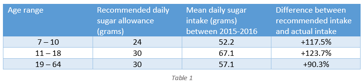

## 2 Background and Motivation
  * [2.1 An overview of the problem: background literature](/README.md#an-overview-of-the-problem-background-literature)
  * [2.2 Identifying the cause: academic research](/README.md#identifying-the-cause-academic-research)
  * [2.3 Tackling the problem: industry review](/README.md#tackling-the-problem-industry-review)

### 2.1 An overview of the problem: background literature

Most adults and children in the UK consume too much sugar, and this poses significant health risks to the population as people are at greater risk of obesity, type 2 diabetes, heart disease, and tooth decay [1]. Table 1 uses data from the NHS [1] and the National Diet and Nutrition Survey (NDNS) [2] to illustrate exactly how much excess sugar is consumed by people in the UK.

It is clear from the data that:
-	On average, each demographic consumes more than their recommended daily allowance
-	The 11 – 18 age range consume the most excess sugar at roughly 2.2x their allowance
-	All children and young adults consume over double their allowance 
-	Adults consume less excess sugar than other age groups but still a significant amount more than their recommended daily allowance

Additional data from the NDNS shows that sugar consumption has decreased over time, roughly by 14.4% for 11 – 18 year olds and 7.6% for 19 – 64 year olds between 2008 and 2016. At this rate, however, it would take over fifty years for actual consumption levels to match those recommended by the NHS. Given the adverse health effects of excess sugar consumption, this is a serious issue and accelerating the decrease in sugar intake would be greatly beneficial for the health of the population.

### 2.2 Identifying the cause: academic research

To address this issue, it is crucial to understand why people are consuming excessive amounts of sugar in the first place. [3] highlights that the main sources of sugar in peoples diets are from processed foods such as cereals, confectionary, and non-alcoholic drinks. This is partly because there is a lack of awareness surrounding the sugar content of these foods. Consider [4]: 

-	The authors conduct a survey of over 2000 adults, in which participants are shown images of non-alcoholic drinks and asked to estimate the amount of sugar contained in them
-	Both fruit juices and carbonated drinks contain roughly 26g/250ml of sugar 
-	Participants underestimate the sugar content of fruit juices by 48%
-	Participants overestimate the sugar content carbonated drinks by 12%

Most participants are not aware that both drinks contain similar levels of sugar, and they perceive the juice be a healthier alternative. If people were properly informed about the sugar content of soft drinks and other processed foods, they would likely make healthier choices in the real world when deciding what to consume. So how can we raise awareness about excess sugar consumption and educate people on the quantities of sugar in foods?

### 2.3 Tackling the problem: industry review

Institutions often influence the behaviour of large groups of people through ‘nudging’. This involves subtly changing one’s choice environment to alter their actions in a predictable way without forbidding any options [5]. Nudging has already been applied to the UK food and drink sector in the form of nutrition labelling [6], where manufacturers are required to list an overview of the macronutrients present in processed food on their packaging. This makes people aware of how much sugar is contained in the food, and enables them to make informed decisions without limiting their options. However, there are several drawbacks of this approach:

-	The sugar amounts presented on these labels (often in grams) do not translate into common units such as teaspoons, and therefore individuals may struggle to visualise how much sugar they are actually consuming [7]. 
-	Nutrition labelling is mandatory, and manufacturers do not have an incentive to educate the people purchasing their products; the labels are often in small print and only those who are intentionally looking for it are likely to see it.

An alternative approach is to purposely educate people about the sugar content of foods outside of any purchasing environment. Several studies have been conducted about the use of serious games to educate and influence the eating habits of children and adults.

1. Sharma et al. (2015) [8]
    * The study is conducted on a sample of 94 children in fourth and fifth grade (44 in intervention group and 50 in comparison group)
    * The intervention group play ‘Quest to Lava Mountain’ (a resource-based RPG that shows players the nutritious value of healthy foods) for an average of 4.6 hours across 6 weeks 
    * The authors report a statistically significant decrease in sugar consumption across children in the intervention group compared with the comparison group. 

2. Skouw et al. (2020) [9]
    * The study randomises 14 families into a game-group and non-game-group
    * The game-group play ‘The Kingdom of Taste’ (a board game designed to spark interest in healthy meal composition) during a three week intervention period
    * Each group takes qualitative tests before and after the intervention period, and the authors record a significant positive change in food behaviour in most families 

A review paper by Baranowski et al. (2019) [10] surveys 22 similar studies on dietary education and behaviour change games. They find that all but one of these reported positive changes in eating habits from playing the game. This finding supports the notion that healthy eating may be promoted through game-based nutritional education, and suggests that educational games might be an effective way to tackle excess sugar consumption.

In light of this, we develop a gamified learning tool in the form of a web application. Players are required to feed a hobbit throughout the day by selecting their food for seven different meals. After they select a food, its sugar content appears, and this is added to the hobbit’s cumulative sugar consumption for the day. The aim of the game is to make it through the day selecting meals without exceeding the maximum sugar threshold for the hobbit. Several features of our quiz align with those identified in [11] for effective game design in promoting a healthy diet:

-	Story/theme: we apply a storyline to the sugar-quiz with the hobbit theme
-	Rewards: players receive their score at the end of the game based on their performance
-	Feedback: players can reflect on their performance by viewing their meal summaries at the end of the quiz. 
-	Levels/progress: we add ‘villages’ to simulate difficulty levels. Levels are made more difficult by reducing the maximum sugar threshold for the hobbit and by selecting foods for which the sugar content is less obvious. 

Based on our background research, we believe this quiz will provide a fun and engaging way for people of all ages to learn more about the sugar content of various foods. In turn, they will be more informed and able to make healthier dietary choices, which may result in a decrease in excess sugar consumption.

[Home](../README.md) | [Next Section](/SystemImplementation/README.md)
