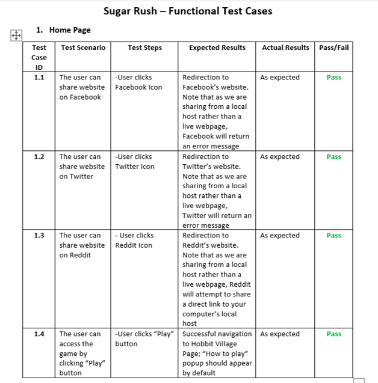

## 6 Evaluation
* [6.1 Evaluation Techniques](README.md#61-evaluation-techniques)
* [6.2 Unit Testing](README.md#62-unit-testing)
* [6.3 Functional Testing](README.md#63-functional-testing)
* [6.4 User Acceptance Testing](README.md#64-user-acceptance-testing)

### 6.1 Evaluation Techniques

#### Timeline of Evaluation


We initially considered having another intermediate testing between the wireframe testing and final testing but did not have time to actualize this. However, we were able to perform a focus group test which was not initially planned. 

#### Observations

The type of observation we undertook was direct observation in a controlled environment. For our design (a game-like application played in short sessions), a controlled environment would not be too different from activity in the field. Direct observation was chosen over indirect observation as we found it to be more efficient to note down details during the process rather than capturing the process automatically and analysing for data later. We also did not have the human resources or time to record many tests. This might have limited our data collection in that some details might have been missed by the observer.

This method of evaluation was especially useful near the beginning of our sprints, as the open-ended nature of the participant's interaction with our prototype allowed us to gather information we did not previously consider regarding our design. However, the data collected using this technique is largely qualitative instead of quantitative, so the importance of certain design choices may not be exactly as we interpreted (for example, something that bothered one participant might not be as big of a problem to most of our target users).

#### Interviews

Our observations took place after a brief interview with the participants to find out more about their preferences in gaming. This allowed us to cross reference our findings from the observations with personas and thus create focused user stories.

Unfortunately, for both the interview and the observation, we were unable to interact with our original main target audience (teens and children) because this required an extra ethics approval, which we submitted but were not able to get in time for the project. This meant we only had data on a limited demographic.

For more information about what design choices we made based on the results of the inital round of interviews and observations, please refer to the [UX Design](/UXDesign/README.md#44-user-interviews) section of our report. You can also [click here](user_interview_round_1.pdf) to see our user interview script for the initial round.

#### Focus groups

Our focus group had a format similar to the inital observation and interview, with discussions between the observer and multiple participants at the same time. A focus group allowed us to obtain responses from more participants at once. However, because there were multiple participants, the navigation of the application was controlled by the interviewer, and he would ask the participants to instruct the next steps. Because this evaluation was closer to the end of the build process, we were also more clear of our design intentions and asked more pointed questions about certain design choices we made to get feedback on them. There was sometimes unprompted discussion or brainstorm about certain features of the application, which allowed us to see how our application was interpreted compared to our intentions, much like in the first round of evaluation. Encouraging discussion between the participants also may have resulted in some form of synergy - i.e. some ideas may arise which would not have during one-on-one discussion with just one participant.  

However, within a focus group, the group dynamic may have also affected the discussion negatively. For example, a stronger voice or opinion may overpower everyone else, or people may have been more inclined to voice an opinion in agreement. With a larger group of people, it was also sometimes more difficult to guide the discussion which meant that there were more (perhaps less helpful) tangental discussions. Also, the interviewer noted that the focus group was comprised of his own friends which could have resulted in biased opinion.

#### Questionnaires

We did not use questionnaires for our first evaluation because we wanted to record how the participants interacted with our prototype which would not be possible (or more difficult) with a questionnaire. We recognised, however, that some evaluation in the form of questionnaires might have been useful in allowing us to collect more quantitative data, and may have allowed us to collect a larger quantity of responses overall. This may have also been better suited for a final evaluation to identify how successful we were at achieving our overall goals and objectives.

#### Ethnography

Given that our application was a relatively straightforward game format, we felt that performing an ethnography would not be worth the amount of time and resources that would have needed to go into it. We also believe that none of us are qualified to extract accurate and useful data from this form of evaluation. As such, this was not a method that we considered.

### 6.2 Unit Testing

We used unit testing to evaluate behaviour of our application through a series of automated tests. Our unit testing strategy uses the Jasmine Test Framework[<sup>[1]</sup>](README.md#references), which is incorportaed into Angular during install. After the creation of a component or service, a `spec.ts` file is create alongside the `html`, `css`, and `ts` files. 

For our project, all components and services run at least one unit test to show that it can be created. To complete this test, some components require the use of mock services.

```javascript
providers: [
   MealSummaryComponent,
   {provided: HobbitService, useClass: TestHobbitService}
]
```

Services and most components were not tested further than this, however, our more complex components have additional unit tests:
  - AppComponent
    - Check component has title 'sugarRush'
  - FoodQuizComponent
    - Check Next Meal button appears by default
    - Check End Game button replaces Next Meal button at end of quiz
    - Check End Game button routes to game-end component
  - QuizProgressComponent
    - Check hobbit has sugar tolerance
    - Check sugar threshold matches tolerance
    - Check initialised sugar teaspoon count is zero
    - Check teaspoon count increases with changed sugar level
  - SugarContentComponent
    - Check teaspoon representation of sugar exists
    - Check sugar content is only visible after selecting a food
  - GameOverComponent
    - Check correct end game message
    - Check correct score is visible
 
The unit tests for these components focus on ensuring dynamic HTML elements appear as expected under appropriate conditions. Components that rely on input, like the QuizProgressComponent, needed mock input to function:

```javascript
beforeEach(() => {
   fixture = TestBed.createComponent(QuizProgressComponent);
   component = fixture.componentInstance;
   component.hobbit = {
      name: "Test Hobbit",
      sugarTolerance: 42,
      sugarIntake: 0
   }
   component.sugarLevel = 0;
   fixture.detectChanges();
});
```

Use of the testing framework's `TestBed` and `ComponentFixture` allowed us to test the dynamic changes. After making changes to properties within a component, we could update its HTML by using a `detectChanges()` method. From here we could gather information about the element based on CSS classes and verify it contains the right information. We can use this strategy to check things like whether a component is visible:

```javascript
it('should show icon only when food selected', () => {
   let visibleValue = html.query(By.css('.iconWrapper'))
      .styles.visibility;
   expect(visibleValue === "hidden").toBeTrue();
   component.showAnswer = true;
   fixture.detectChanges();
   visibleValue = html.query(By.css('.iconWrapper'))
      .styles.visibility;
   expect(visibleValue === "visible").toBeTrue();
});
```

A complete list of unit tests can be reviewed [here](unitTests.png). To further improve our unit testing, we would add tests for the quiz that better mock food selection and the corresponding HTML changes, such as presence of the correct images and icons. In order to implement these changes, further research and understanding of the Jasmine testing framework is required.

### 6.3 Functional Testing

To test the functionality of our system, we opted for manual, scenario based testing. We conducted this testing through a series of test cases, where we documented specific scenarios for each user interaction with our application. You can [click here](Functional_Test_Cases_PDF.pdf) to view our full test case log. 



The advantage to this method, in comparison to more technically complex alternatives such as automated testing, was its upfront time efficiency. As our application is currently a minimum viable product, the path through the application is relatively simple and user interactions with the site are not complex. We were therefore able to rapidly develop and use these test cases.

However, there were some disadvantages to this approach. The manual nature of our testing approach reduced the overall efficiency and agility of our development process. It also exposed us to a certain level of risk around human error in the testing process. As previously stated, while our application is not yet of a sufficient size for this to have seriously hindered our progress, we would look to implement supplementary automated testing methods in future development work, as our application grows in size and scope. 

THIS SECTION BELOW WAS COMPLETED AS THE PROJECT EXTENSION

### 6.4 User Acceptance Testing

#### Introduction and Method

To complete testing and perform a final evaluation of our web application, we conducted an additional round of user interviews using this [script](uat_interview_script.pdf). 

We measured the success of our application against the four key objectives originally outlined in the introduction:

1.	_Functionality_ – confirming that the application was functional
2.	_Usability_ – verifying that our design was visually engaging and interactive
3.	_Information_ – determining whether our application displayed sugar levels appropriately and effectively
4.	_Education_ – determining whether the game increased awareness of sugar consumption and influenced dietary behaviour

To reflect these objectives and ensure we gathered appropriate feedback, our interview was split into three key sections: 

1.	_Contextual information_ – collecting gaming preferences and background information about the user
2.	_Functional test cases_ – a series of tasks to confirm the user was able to navigate through the application as expected and to uncover any remaining bugs
3.	_Free browsing_ – allowing the user to explore the application as they wished, and gathering feedback on the application’s usability and informational/educational aspects. 

#### User Group and Interviews 

We gathered a sample size of n = 5, in the range of recommended to perform usability studies (4 – 8)[<sup>[2]</sup>](README.md#references).  Efforts were also made to gather a mix of genders and age groups to reflect the diversity of our target user base. As previously stated, we were unfortunately not able to interview any children as part of UAT, due to the fact that we did not receive ethical approval in time. 

The detailed write up and outcome of each interview can be viewed here:

 - [Male, 34](Sugar%20Rush%20-%20User%20Interviews%2034M.docx)
 - [Female, 60](Sugar%20Rush%20-%20User%20Interviews%2060F.docx)
 - [Female, 29](Sugar%20Rush%20-%20User%20Interviews%2029F.docx)
 - [Female, 27](Sugar%20Rush%20-%20User%20Interviews%2027F.docx)
 - [Male, 19](Sugar%20Rush%20-%20User%20Interviews%2019M.docx)

Due to Covid-19 limitations, these interviews were mostly held remotely, using Microsoft Teams’ screen control functionality. This was not ideal, as the user’s engagement with the application was not entirely natural. However, it was not obstructive to the process, and we were still able to gather sufficient quality feedback to be able to perform an evaluation of our application. 

#### Findings 

1. _Functionality_

This area of evaluation was largely successful. All users were able to successfully complete the tasks assigned during the test case phase of the interview without guidance, and no bugs in the application were identified. 

Most users felt that the game was straightforward and easily navigable; it was described as “smooth”, “pretty common sense” and “self-explanatory”. Minor issues were noted with the scrolling required during the quiz stage of the app - one user did not immediately notice it, and this caused some temporary confusion during gameplay. 

4 out of 5 users attempted the game more than once, either to experiment with different answers or to ensure that they won the game. All of those who attempted the game more than once were able to remembered their answers from their previous attempt, which affected their gameplay. 

2. _Usability_

This was an area of mixed success. All users had positive feedback about the colour scheme of the application, reporting that it was “easy on the eyes”, “game appropriate” and “readable”. However, some noted that it was not fully consistent throughout the whole application – certain buttons and the hobbit on the quiz and game over pages were not “on theme” and thus stuck out. 

The hobbit theme itself was an area of contention for users. All users commented that it was not particularly apparent during gameplay. Some users, when prompted, expressed a liking for it, but those who did were more likely to have described themselves as avid gamers who regularly played a wide variety of games. More casual gamers, or those who expressed little interest in gaming were more likely to feel ambivalent about it. Those who did like it also acknowledged that it might be a more niche area of interest (“I liked it, but that’s maybe because I’m a geek”). Therefore, while the hobbit theme did not actively detract from the users’ engagement with the game, it did not significantly enhance it either. 

While all users enjoyed the core concept of the quiz – trying to guess the item with the lowest sugar – some described it as “too easy” and expressed concern that it could become repetitive quite quickly. Some also noted that some of the meal choices seemed odd or “overly simplistic” to them – for example, jam and peanut butter – and that they would have preferred more realistic meals. As an improvement on these issues, multiple users suggested that it would be more fun to pick a combination of items from a range to create a meal. 

Another area of contention was the scrolling on the quiz page; some users found this annoying, and reported that it detracted from their engagement with the game. 

3. _Information_


### Appendix
1. [User interview round 1 script](user_interview_round_1.pdf)
2. [List of unit tests](unitTests.png)
3. [Functional test cases](Functional_Test_Cases_PDF.pdf)
4. [User acceptance testing script](uat_interview_script.pdf)

### References
1. Jasmine Tesing Framework - https://jasmine.github.io/
2. Plan user research for your service - Service Manual - GOV.UK - https://www.gov.uk/service-manual/user-research/plan-user-research-for-your-service

[Previous Section](/UXDesign/README.md) | [Home](../README.md) | [Next Section](/Conclusion/README.md)
