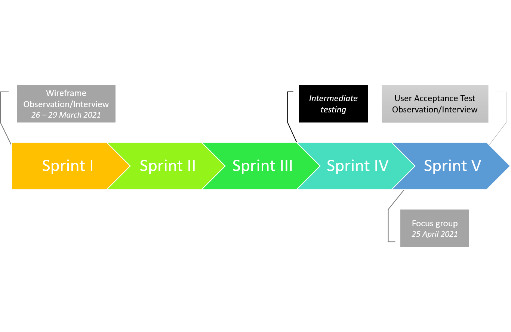

## Evaluation

### Evaluation Techniques

#### Timeline of Evaluation

We initially considered having another intermediate testing between the wireframe testing and final testing but did not have time to actualize this. However, we were able to perform a focus group test which was not initially planned. 

Most of our evaluation was performed through a combination of observation and interview.

#### Observations

The type of observation we undertook was direct observation in a controlled environment. For our design (a game-like application played in short sessions), a controlled environment would not be too different from activity in a field. Direct observation was chosen over indirect observation as we found it to be more efficient to note down details during the process rather than capturing the process automatically and analysing for data later. We also did not have the human resources or time to record many tests. 

This method of evaluation provides a greater degree of freedom, thus allowing us to gather information we did not think of regarding our design. We were also to note down details in how the users interacted with our wireframe. However, the data collected using this technique is largely qualitative instead of quantitative.

#### Interviews

Our observations took place after a brief interview with the test users to find out more about their preferences in gaming. This allowed us to cross reference our findings from the observations with personas and thus create focused user stories.

Unfortunately, for both the interview and the observation, we were unable to interact with our original main target audience (teens and children) because this required an extra ethics approval, which we submitted but was not able to get in time for the project. This meant we only had data on a limited demographic.

For more information about what design choices we made based on the results of the interviews/observations, please refer to the [UX Design](/UXDesign#user-interviews) section of our report.

[Click here](Sugar Rush - User Interviews Part 1) to see our user interview script for round 1.

#### Focus groups

#### Questionnaires

#### Ethnography

*  Details of how you evaluated your designs (techniques used & awareness of their limitations). Description of  techniques suitable for your particular design. A timeline of evaluation of your design.  
    * Techniques to evaluate
        * Hypotheses driven --> these have been outlined in the design stage
        * What other methods did we use? Check out Interaction Design  5th edition for extra info
    * Limitations of techniques --> These are in the powerpoint for the HCI evaluation lecture. Reference these in a way that shows we understand, not just copy and pasted.
    * Description of techniques suitable to our design
        * Questionnaires
            * evaluate designs and ideas and get demographic info
            * feasible number of questions
            * How is this suitable to our design?
            * What limitations did this have?
        * Observations
            * Observe a user using the product, but record what you see without leading them
            * Are the products used as intended
            * Used throughout development
            * How is this suitable to our design?
            * What limitations did this have?
        * Interviews
            *  one to one interactions with stakeholders and end users
            *  How is this suitable to our design?
            *  What limitations did this have?
        * Focus Groups
            * group interviews to capture feelings and eperiences
            * We'll skip this one.
        * Ethnography
            * shadowing users or method acting and training to become an end user
            * Get a fine-grained understanding of user context (political, social, etc)
            * We can try this, but it might be difficult.
    * Timeline of evaluation
        * How often and when did we do the above methods?
*  Unit testing / Functional testing.
    * Unit testing
        * What methods did we use for Unit testing?
        * This is how we tested different components.
        * Which components did we test?
        * How did we test them?
        * What could have been better and or what was a limitation of the method we used?  
    * Functional testing 
        * What methods did we use?
        * This is a form of black-box texting.
        * What could have been better or what was a limitation of this method?
*  User acceptance testing. Evaluation of your design with users – methods undertaken, findings, implications.
    * User acceptance testing
        * Different from the user interviews, but the final round of user interviews and verifiying the 
    * Evaluation of design with users
        * Methods
            * Can user interviews go here? We can move that from the design section to here if so, and that is already drafted.
            * We can also do observations for this as well
        * Findings
            * Not just findings, but how did this align with our hypotheses?
            * How did we ask questions that were not leading questions?
            * Check out HCI evaluations PowerPoint on this as well. 
        * Implications
            * Did our methods work?
            * Could we expand from sugar to other types of nutritional information?
            * Can we use this method to raise awareness of quantity of sugar in food items?
