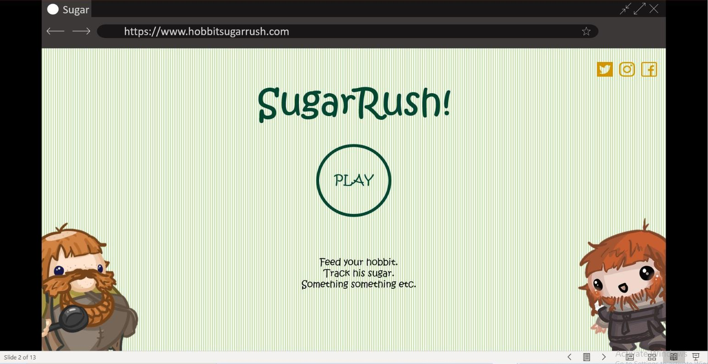

# Sugar Rush

*set out on an adventure to the pantry!*

## Team

* [Zack Turman](https://github.com/zkturman)
* [Zain Ansari](https://github.com/zainansarii)
* [Olivia Green](https://github.com/livigreen)
* [Kyle Steckbauer](https://github.com/kesteckb)
* [Angela Liu](https://github.com/angelaliuyl)

 [View our team notes!](https://1drv.ms/u/s!ArK70JvM660kiJU316Riv8bJ639P4A)

## 1. Introduction

### Abstract
Eating too much sugar can contribute to a variety of negative health conditions. Currently, there is a lack of awareness surrounding sugar content in various foods, and people unintentionally consume larger than recommended amounts. We want to help raise awareness around sugar content in food to help empower people to make more conscious dietary choices. To accomplish our goal, we set out to create a web application using serious play.

In this project, we create a game targeted at people of all ages that offers an educational experience. Player are tasked with choosing food for a hobbit throughout their day, which spans seven meals:
  - Breakfast
  - Second Breakfast
  - Elevenses
  - Luncheon
  - Afternoon Tea
  - Dinner
  - Supper  

For each of these meals, the player will be presented with a selection of various foods. Each selected food then contributes to the hobbit's daily sugar consumption, so players are encouraged to select the foods they perceive have the least sugar. Because the point of the game is to educate the players on sugar content, we show the amounts of sugar in each food choice after the players make their selection. Intead of showing the sugar content numerically, as is done on nutrition labels, we show sugar amounts through representative icons, such as a teaspoons or sugar-cubes. Through this graphical representation, users can gain a more intuitive understanding of sugar content. 

In order to win the game, users need to make it through all seven meals without consuming more than the daily recommended amount of sugar for human adults [1]. Following the completion of the quiz, players will be able to share the site with others in order to help educate more people. 

### Project Objectives

Our project is broken into two overarching goals, one dedicated to tackling our serious problem and the other focused on creating a playful applcation. For each overarching goal, we created two primary goals for our project, which were then broken into necessary objectives. 

#### Display food sugar levels effectively
Because we want people to learn more about the sugar content in foods, our application needs to provide this type of information to the user. In order to achieve this goal, players need to be able to see the amount of sugar that has been consumed by their hobbit. Players should be able to see this information during the quiz and be able to review it afterwards.

#### Guide behaviour of the user
In addition to educating users about sugar content, we want to inspire behavioral changes. In order to accomplish this goal, our application needs visual indicators to show a user when food has high amounts of sugar. Our application should achieve this through visual indicators, such as colours or the emtional response of the hobbit.

#### Produce a functioning quiz
To get users to engage with our application, it is important that our quiz functions. We believe bugs and glitches will lead to a suboptimal experience that will inhibit the playability of our game. If users cannot play or enjoy the game, they will be unlikely to continue playing or share the game with others.

#### Design visually and engaging interactive experience
To increase the playability of the application, we believe the website needs to be visually appealing. Clean aesthetics can lead to a better user experience that will encourage people to visit the website and share it with others.

### Demo Video

### How to Run
  1. Clone or fork this repository
  2. In your local repository, navigate to the SugarRushSite directory
  3. Add a .env file with the appropriate environment variables
  4. Run `docker compose up --build`
  5. When the site is finished building and you see the successful connection message, navigate to the local host on your device (probably http://localhost:3000/).

## [2. Background and Motivation](BackgroundAndMotivation/README.md)
  - [2.1 An overview of the problem: background literature](/BackgroundAndMotivation/README.md#21-an-overview-of-the-problem-background-literature)
  - [2.2 Identifying the cause: academic research](/BackgroundAndMotivation/README.md#22-identifying-the-cause-academic-research)
  - [2.3 Tackling the problem: industry review](/BackgroundAndMotivation/README.md#23-tackling-the-problem-industry-review)

## [3. System Implementation](SystemImplementation/README.md)
  - [3.1 Overview](/SystemImplementation/README.md#31-overview)
  - [3.2 Database](/SystemImplementation/README.md#32-database)
  - [3.3 Server](/SystemImplementation/README.md#33-server)
  - [3.4 Client-side Application](/SystemImplementation/README.md#34-client-side-application)
  - [3.5 Additional Features](/SystemImplementation/README.md#35-additional-features)
  - [3.6 Deployment](/SystemImplementation/README.md#36-deployment)

## [4. UX Design](UXDesign/README.md)
  - [4.1 Ideation](/UXDesign/README.md#41-ideation)
  - [4.2 User Groups](/UXDesign/README.md#42-user-groups)
  - [4.3 Design Heuristics](/UXDesign/README.md#43-design-heuristics)
  - [4.4 User Interviews](/UXDesign/README.md#44-user-interviews)
  - [4.5 Impact of Design](/UXDesign/README.md#45-impact-of-design)

## [5. Sprints & Project Management](SprintsAndProjectManagement/README.md)
  - [5.1 Team Communication](/SprintsAndProjectManagement/README.md#51-team-communication)
  - [5.2 Team Member Roles](/SprintsAndProjectManagement/README.md#52-team-member-roles)
  - [5.3 Sprint Overview](/SprintsAndProjectManagement/README.md#53-sprint-overview)
  - [5.5 Continuous Integration](/SprintsAndProjectManagement/README.md#54-continuous-integration)

## [6. Evaluation](Evaluation/README.md)
  - [6.1 Evaluation Techniques](/Evaluation/README.md#61-evaluation-techniques)

## [7. Conclusion](Conclusion/README.md)
  - [7.1 Group Work Reflection](/Conclusion/README.md#71-group-work-reflection)
  - [7.2 Success Reflection](/Conclusion/README.md#72-success-reflection)
  - [7.3 Impact of Pandemic](/Conclusion/README.md#73-impact-of-pandemic)
  - [7.4 Social and Ethical Impact](/Conclusion/README.md#74-social-and-ethical-impact)
  - [7.5 Future Work](/Conclusion/README.md#75-future-work)

[1] [Sugar: the facts](https://www.nhs.uk/live-well/eat-well/how-does-sugar-in-our-diet-affect-our-health)
