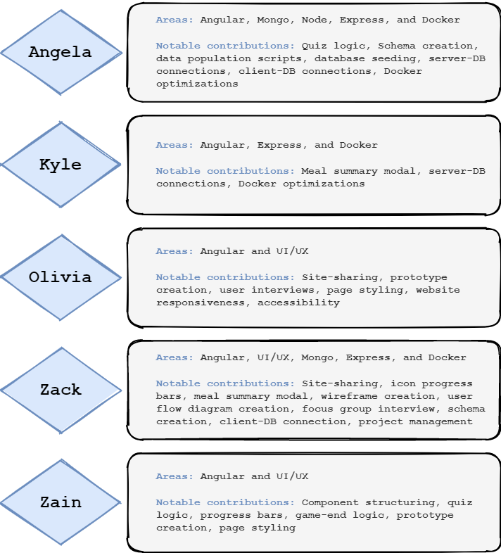

## Sprints and Project Management
Throughout our group project we relied on agile to help divide and plan our project. Our workflow was a slightly modified version of the agile process outlined here: https://www.atlassian.com/agile/project-management/workflow.
We did not incorporate Epics into our workflow as the entire project could probably be boiled down to one or two Epics. However, we did take advantage of several aspects from agile: standups, sprints, and kanban. We used a backlog as a place to hold all tasks we wanted to achieve during our project. In addition to this, we also created a secondary backlog for features we would like to implement, but weren’t critical to the minimum viable product.   
	
Sprints were the primary tool that we used to group our project tasks. Sprint planning was completed on the Friday before sprint, and all user stories were documented in a kanban board (link: https://trello.com/b/ZzT0p21S/site-development) for task management. We met each weekday for a standup meeting that we used to discuss the following:
  - Tasks
      - Things we've done between the previous meeting and now
      - Things we're planning to work on today
      - Review designs for integrated developement
      - General questions or topics about the project
 
In addition to these talking points, we had three goals we wished to accomplish during these meetings: assign tasks, balance workload among members, and raise awareness of current taks. Sticking to the nature of standups, though we had much to discuss, we tried to keep the meeting short, where each meeting averaged between 15-30 minutes. 

In addition to standups and regular meetings our team also used other means of communication. During the day, we used an ongoing chat for quick one off questions and notifications. For more complicated questions and tasks, we also used video calls to talk through the questions. We would also take advantage of pair programming during these calls to complete a task together. Finally, we scheduled working sessions that served as a dedicated block of team for team members to focus on a given sprint's task. These sessions were freeform and meant to simulate the feeling of working together in a computer lab.
	
We initially considered using the waterfall project management style for our project, but the flexibility offered by Agile was preferred. In addition, waterfall has some disadvantages which did not work well for our team. For example, waterfall projects tend to focus on one stage of development at a time (https://www.atlassian.com/agile/project-management/program). As a result, this method presented challenges for our team. Because development cycles focus on specific areas of the development stack, team members are working are always working int the same area. While this does lead to a well-rounded developer, it prohibits team-member specialisation. Team member motivation can also be damaged if members are forced to work on areas that they aren't interested. Finally, the planning aspect of waterfall is risky and could be eratic. Phases are large and all-encompassing, making them difficult to plan, and one phase of the project can force every subsequent phase to be delayed. We decided agile worked best for our team because it is more flexible and allows developer specialisation.  

Our members specialised in areas that initially piqued our interests. We agreed to have multiple people in each area, and if one area was uninteresting or frustrating, members could switch roles to maintain maximum motivation. When determining roles, we initially divided roles between front end and back end. Within front-end roles, members specialised in either Angular development or UX/UI. For back-end roles, members specialised in Mongo, Node, or Express. Members could choose 2-3 roles of their choosing, able to mix and match between the two categories. In addition to these roles, we also assigned a project manager role. While each member did specialise, each also helped with varying development across sprints, allowing general knowledge in multiple areas. An overview of areas and contributions can be found below.  
  

During our project we used one-week sprints to divide our project. The contents of each sprint were determined during our weekly sprint planning meetings, which took place during our Friday standups. To keep these planning sessions focused, we created goals and guidelines to follow. Our primary goal for sprint planning was to have a clear focus for the next sprint. As part of this, we ensured each member knew the type of tasks they would be accomplishing over the next week and, if possible, the user stories they would be tackling. A seconday goal of these meetings was to see how the next sprint helps the team work towards our primary goals. The agenda included the following:
  - Overview of previous sprint's accomplishments
  - Overall team goals for the next sprint
  - Tasks that help achieve these goals
  - Progress towards overall project goals  

Throughout our project, we had a total of six sprints, each lasting a single week. The first sprint occurred the week of 29 March 2021. Each sprint focused on a specific subset of tasks: 
  - [Sprint I](SugarRushSprint1.pdf)
      - Have an application that builds successful
      - Basic components and site navigation
  - [Sprint II](SugarRushSprint2.pdf)
      - Convert components to match wireframe
      - Hardcoded data for a mock backend
  - [Sprint III](SugarRushSprint3.pdf)
      - Create a functional quiz page
      - Connect application with database
  - [Sprint IV](SugarRushSprint4.pdf)
      - Make game end dynamic depending on quiz
      - Improve Github documentation
  - Sprint V
      - Improve Github documentation
      - Improve sugar indicators throughout application
  - Sprint VI
      - Make village funcitonal
      - Improve Github documentation

Users stories were used to guide each sprint and the above goals. While the goal was to complete user stories within one sprint, however unforeseen complications and competing priorities sometimes delayed user stories. When a user story was delayed, this was considered for the next sprint so that more manageable tasks were planned.

During our sprints, three main features served as highlights for our project. During Sprint III, when we finished the basic functionality for the quiz component we were much closer to accomplishing our minimum viable product. At this stage, we had connected the quiz to our food database and could pull question contents and information from it. The user could also complete a quiz that logged the total amount of sugar from their quiz answers. This was the most critical moment in our project. During Sprint III and IV, we added functionality to allow user state to flow from one component to another via our services. We used this functionality to create a dynamic game-end component that allows users to review quiz results and answers. These features marked another step towards arriving at our minimum viable product. Finally, another highlight was the successful implementation of Docker for all team members. Prior to a functional Docker container, the team had encountered issues due to varying versions of frameworks and Angular modules. Docker implementation also allowed us to seed our database identically and connect our website to expected data. These three accomplishments form the backbone of the current vresion of our product.    

Throughout our project, we used Git to achieve continuous integration. When first starting the projectwe took advantage of git as a tool for continuous integration. Our initial strategy involved having two primary branches: the [main](../../../) branch was used for a demo-ready environment; the [develop](../../../tree/develop) branch was used to implement new features based on our user stories. In order to implement new features for our `develop` branch, we created individual feature branches from `develop`. When we completed these features, they were merged into `develop`. As our application took shape and became more complex, we implemented testing processes to ensure new features did not cause loss of previous functionality.

However, as development continued and issues were uncovered, we discovered we needed amore robust process established a more rigorous development schedule:  

For our [process](SugarRushDevCycle.pdf), we made several key decisions. All branches must be made from an up-to-date `develop` branch. In theory, new features could rely on a feature that is in the midst of development. In this situation, it would be possible to branch from a feature branch. However, we decided to plan these tasks sequentially to avoid merge conflicts. After completing the first version of a feature, testing was required. The testing process consisted of round of testing. For complex, integrated changes, two rounds of testing were required, one performed by the developer and one by another team member. Simple changes required one round of testing. A round of testing consisted of following steps:
  1. Test website in feature branch
  2. Test website in `develop`
  3. Merge feature branch into local `develop` branch
  4. Test website in `develop`

Creating steps 2 and 3 was a critical moment for our team and helped streamline the testing process. Step 2 eleminates ambiguity during testing. If testing fails during this stage, the developer knows there is an existing problem in develop. Step 3 allows for a test merge before pushing the change to the entire team. If testing fails during this stage, the developer knows a problem was introduced by the new feature.

Finally, after features were completed with testing the feature was staged in develop by merging the feature into `develop` via a pull request. Alternatively, we could have pushed the local `develop` merge from testing to the remote repository. However, we viewed this as an unsafe action. A `git push` command has few guardrails and limited documentation compared to the pull request feature in GitHub. This functionality also allows members to delete the remote feature branch during the merge. Merges with conflicts were the exception to this rule. In these situations, the merge had to be handled through Git, and the GitHub pull request could not manually merge the branches nor handle the conflict resolution. 

The final step of our continuous integration cycle was to publish features to our `main` branch by merging `develop` into `main`. This merge occurred biweekly on Fridays at the end of the current sprint. We chose this time frame to allow to incorporate changes from the previous two sprints. As some user stories from the previous sprint may have run over two sprints, this allowed a greater number of features to be included in `main`. If issues were present in `develop`, we were more likely to find them over a two-week period. Therefore, the delay for updating `main` allowed it to remain stable, which was ideal considering its main purpose was for demos.   

[Return to Main Page](../../../)
