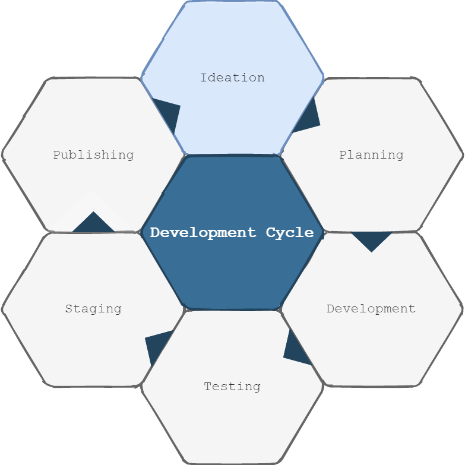

## Sprints and Project Management

### Team Communication
Throughout our group project we relied on agile to help divide and plan our project. Our workflow was a slightly modified version of the [agile process](https://www.atlassian.com/agile/project-management/workflow). We did not incorporate Epics or Initiatives into our workflow as the entire project fit into one or two Epics. However, we did take advantage of several other aspects from agile: standups, sprints, and kanban.   

We initially considered using the waterfall project management style for our project. However, waterfall has some disadvantages which did not work well for our team. [Waterfall-style projects](https://www.atlassian.com/agile/project-management/program) inhibit team member specialisation because developers focus on only part of the development stack during each stage. Team member motivation can also be damaged if members are forced to work on uninteresting areas. Finally, the planning aspect of waterfall is risky and could be eratic. Phases are large and all-encompassing, making them difficult to plan, and one phase of the project can force every subsequent phase to be delayed. Agile worked best for our team because it is more flexible and allows developers to specialise in areas they prefer.  
	
Sprints were the primary tool that we used to group our project tasks and communicate goals. Regular meetings regarding sprints were the bulk of our team's communication. In addition to these meetings our team also used other means of communication. 
  - Instant messaging for one off questions and announcements
  - Video calls for discussing complicated questions and tasks
  - Paired programming for completing challenging development
  - Working sessions to focus on sprint tasks and simulate working concurrently in a computer lab

Working sessions were introduced later in the project to induce certain working conditions. Throughout the project, team memebers felt they were missing the opportunity to work together like we would have without virtual learning. These sessions helped provide the team with an opportunity to ask questions or work individually throughout a set period of time.

### Team Member Roles
Our members specialised in areas that initially piqued our interests. We agreed to have multiple people in each area, and if one area was uninteresting or frustrating, members could switch roles to maintain maximum motivation. When determining roles, we initially divided roles between front end and back end. Within front-end roles, members specialised in either Angular development or UX/UI. For back-end roles, members specialised in Mongo, Node, or Express. Members could choose 2-3 roles of their choosing, able to mix and match between the two categories. In addition to these roles, we also assigned a project manager role. While each member did specialise, each also helped with varying development across sprints, allowing general knowledge in multiple areas. An overview of areas and contributions can be found below.  
  

### Sprint Overview

During our project we used one-week sprints to plan our work. 

The contents of each sprint were determined during our weekly sprint planning meetings, which took placen on Friday mornings. To keep these planning sessions focused, we created goals and guidelines to follow. The agenda included the following:
  - Overview of previous sprint's accomplishments
  - Overall team goals for the next sprint
  - Tasks that help achieve these goals
  - Progress towards overall project objectives 

Tasks for the week were planned in the form of user stories, which were documented in a [kanban board](https://trello.com/b/ZzT0p21S/site-development). Within this tool, we used a backlog as a placeholder for all tasks we needed to produce our minimum viable product. We also had a secondary backlog for non-critical features we would like to implement if time permits. 

Following the planning meeting, the sprint would run the following week from Monday to Sunday. On each weekday we met for a [standup meeting](https://www.youtube.com/watch?v=er9gntPjTJU) to discuss the following:
  - Things we've done between the previous meeting and now
  - Things we're planning to work on today
  - Designs for integrated developement
  - General questions or topics about the project   
The primary goals of these meetings were to assign tasks, balance workload among members, and raise awareness of current tasks. Because standups are intended to be shorter meetings, we tried to keep the meetings between 15-30 minutes. 

Throughout our project, we had a total of five sprints, each lasting a single week. The first sprint occurred the week of 29 March 2021. Each sprint focused on a specific subset of tasks: 
  - [Sprint I](SugarRushSprint1.pdf)
      - Have an application that builds successful
      - Basic components and site navigation
  - [Sprint II](SugarRushSprint2.pdf)
      - Convert components to match wireframe
      - Hardcoded data for a mock backend
  - [Sprint III](SugarRushSprint3.pdf)
      - Create a functional quiz page
      - Connect application with database
  - [Sprint IV](SugarRushSprint4.pdf)
      - Make game end dynamic depending on quiz
      - Improve Github documentation
  - Sprint V
      - Improve Github documentation
      - Improve sugar indicators throughout application

Users stories were used to guide each sprint and the above goals. While the goal was to complete user stories within one sprint, unforeseen complications and competing priorities sometimes caused delayed. When a user story was delayed, we evaluated the task to determine the root cause of the delay. We then adjusted future sprint planning to prevent similar delays in the future.

During our sprints, three main features served as highlights for our project. During Sprint III, when we finished the basic functionality for the quiz component we were much closer to accomplishing our minimum viable product. At this stage, we had connected the quiz to our food database and could pull question contents and information from it. The user could also complete a quiz that logged the total amount of sugar from their quiz answers. This was the most critical step in our project. During Sprint III and IV, we added functionality to allow user state to flow from one component to another via our services. We used this functionality to create a dynamic game-end component that allows users to review quiz results and answers. These features marked another step towards arriving at our minimum viable product. Finally, another highlight was the successful implementation of Docker for all team members. Prior to functional Docker configuration, the team had encountered issues building the aplication after pulling changes from the remote repository. Using Docker allowed us to have a standard container for our applicaiton. Docker implementation also allowed us to seed our database identically and connect our website to expected data. These three accomplishments form the backbone of the current vresion of our product.    

### Continuous Integration
Throughout our project, we used Git to achieve continuous integration. When first starting the projectwe took advantage of git as a tool for continuous integration. Our initial strategy involved having two primary branches: the [main](../../../tree/main) branch was used for a demo-ready environment; the [develop](../../../tree/develop) branch was used to implement new features based on our user stories. In order to implement new features for our `develop` branch, we created individual feature branches from `develop`. When we completed these features, they were merged into `develop`. As our application took shape and became more complex, we implemented testing processes to ensure new features did not cause loss of previous functionality.

However, as development continued and issues were uncovered, we discovered we needed amore robust process established a more rigorous development schedule:  

For our [process](SugarRushDevCycle.pdf), we made several key decisions. All branches must be made from an up-to-date `develop` branch. In theory, new features could rely on a feature that is in the midst of development. In this situation, it would be possible to branch from a feature branch. However, we decided to plan these tasks sequentially to avoid merge conflicts. After completing the first version of a feature, testing was required. The testing process consisted of round of testing. For complex, integrated changes, two rounds of testing were required, one performed by the developer and one by another team member. Simple changes required one round of testing. A round of testing consisted of following steps:
  1. Test website in feature branch
  2. Test website in `develop`
  3. Merge feature branch into local `develop` branch
  4. Test website in `develop`

Creating steps 2 and 3 was a critical moment for our team and helped streamline the testing process. Step 2 eleminates ambiguity during testing. If testing fails during this stage, the developer knows there is an existing problem in develop. Step 3 allows for a test merge before pushing the change to the entire team. If testing fails during this stage, the developer knows a problem was introduced by the new feature.

Finally, after features were completed with testing the feature was staged in develop by merging the feature into `develop` via a pull request. Alternatively, we could have pushed the local `develop` merge from testing to the remote repository. However, we viewed this as an unsafe action. A `git push` command has few guardrails and limited documentation compared to the pull request feature in GitHub. This functionality also allows members to delete the remote feature branch during the merge. Merges with conflicts were the exception to this rule. In these situations, the merge had to be handled through Git, and the GitHub pull request could not manually merge the branches nor handle the conflict resolution. 

The final step of our continuous integration cycle was to publish features to our `main` branch by merging `develop` into `main`. This merge occurred biweekly on Fridays at the end of the current sprint. We chose this time frame to allow to incorporate changes from the previous two sprints. As some user stories from the previous sprint may have run over two sprints, this allowed a greater number of features to be included in `main`. If issues were present in `develop`, we were more likely to find them over a two-week period. Therefore, the delay for updating `main` allowed it to remain stable, which was ideal considering its main purpose was for demos.   

[Return to Main Page](../../../)
