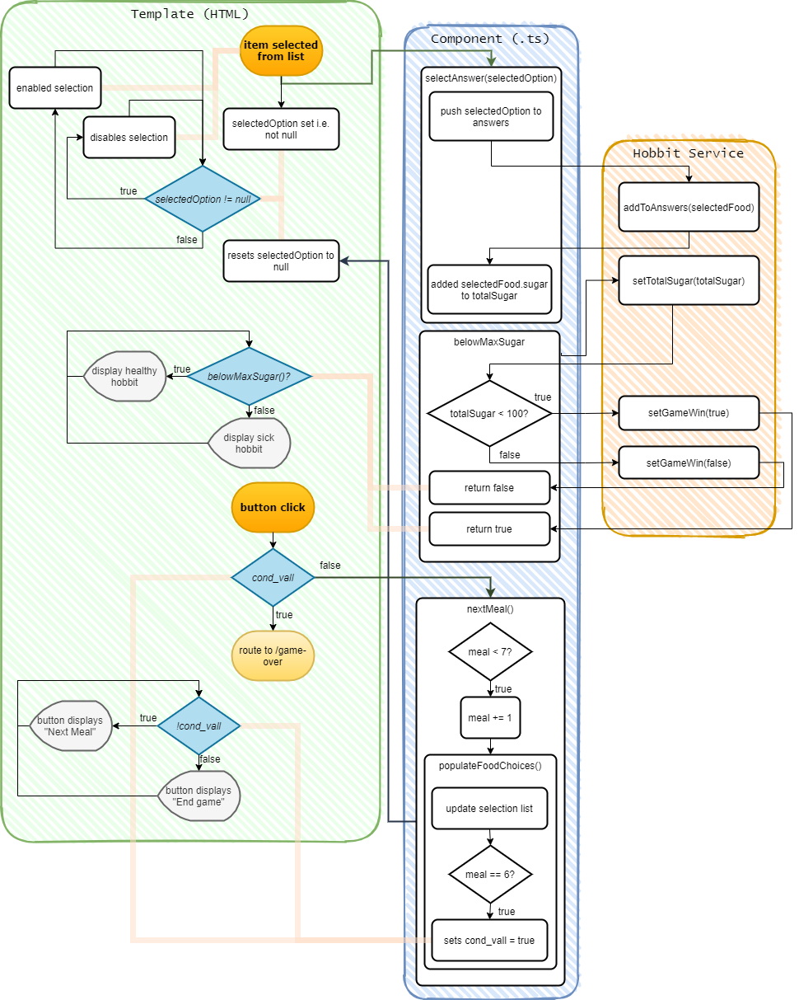

# System Implementation  

## Overview

In our single page application, we chose to use the MEAN stack. MEAN stands for MongoDB, Express, Angular and Node.js. In the MEAN stack, Angular handles the front-end clientside application, MongoDB handles the backend database, and Node.js and Express handle the middle tier server. Specifically, Express handles services and getting data from the database, and node.js provides a runtime environment. 

Below is an example sequence diagram for our application which shows in more detail how the different parts of the stack work together:

## Database

MongoDB is a NoSQL database program which uses JSON-like documents. A NoSQL database is more scalable and flexible compared with traditional SQL databases. To make it easier to use data from the database, the Object Data Modeling (ODM) library Mongoose is used.

Below is the initial data model planned for the application:

However, during development, it was decided that for a minimum viable product the meals collection was not necessary and it was thus not implemented.

- Schema for each collection in the database was defined in the model files in the ./models/ directory.
- API to access each collection was found in ./server/routes/ directory.
- More details on how the documents are accessed is described in the server section.

## Server

- Several RESTful APIs were set up to access each of the collections in the database. Mongoose is used to process these requests and communicate with the database. These were all built on the express framework and setup as illustrated in the diagram above.
- server.js is the main file used to implement the server-side code for Node.js. In the server.js file, Express is configured, connection to database is established through the db.js file, and routing to the APIs are set up.

## Client-side Application

Angular has a couple of uses in developing a web application:
- a component-based framework
- a collection of libraries to handle features including routing, forms, client-server communication
- and a suite of developer tools to help develop, build, test and update the code.

### View

Using the component-based framework, each of the sections of the application is generated dynamically in the appcomponent. The structure of the components is as below: 
(Note that a dashed connection indicates that the connected component is a modal component that can be opened up from the parent component.)

Various modules were imported from Angular material such as icon, divider, button, progress-bar, list, and dialog and used in the components.

### Interactions

Due to the quiz format of the application, the quiz component needs to change dynamically as the user interacts with it. This is achieved through conditional statements in the template (HTML) and class (typescript). The chart below illustrates the processes in this component:

(Yellow blocks shows user input, grey blocks show updated display, blue diamonds show conditional statements in the template, and the orange tracks shows how/when the boolean values checked in the conditional statements are updated.)

### Injectables/Services

The services generated using Angular allow us not only to access the collections from the database, but also allowed us to pass data between components through the front-end. We decided to use this instead of persistent storage as the results for the quiz should only be kept in that particular session and is only needed by the client-side. 

In our application, we need to keep track of the choices made during the quiz, the score, and the condition (win or lose) from the food-quiz component and pass that to the game-end component. 

Note that in order for the modal components to access a service, we found that the service needed to be first linked to MatDialog module. 

## Additional Features
### Seeding the database
The database was seeded using a javascript file. The file makes use of mongoose.
- each collection is cleared using `delete.many({})` 
- new documents are initiated and saved into the collection

This script is ran on start-up of the docker container along with the command to start the express server. This was accomplished by having a bash script that contained both of these commands in the docker-compose.yml file. There will be more details about the deployment of the site in the next section.

### Authentication (or lack thereof)
We first considered incorporating authetication before our first user testing session, but from the results of the user testing, we decided against this. User testing found that most did not see the point of ghaving authetication for this type of application and would have found it either confusing or concerning that it is required. 

## Deployment

### Docker Implementation
For our application, Docker is used for deployment to provide a consistent runtime environment. Our application is run on two containers with one container running the node.js environment and one container running the database.

A Dockerfile is used to build the `nodejs` container within an Alpine image.
  - All packages listed in the project package.json folder are copied to the image
  - All other relevant project files are copied to the image
  - All relevant packages are installed using `npm install`
  - Windows line endings are removed from relevant scripts
  - The site is built using `ng build`
  - Port 3000 is exposed and node is run

The publicly availabe mongo:4.1.8-xenial image is used to run an instance of MongoDB in our `db` container.

A docker-compose.yml file is used to run both containers.
  - Sets relevant environment variables
  - Exposes ports to the host for both `db` and `nodejs` containers
  - Executes script to ensure `nodejs` does not run before `db` is running
  - Executes scrip to seed our database with site data 

### Docker Optimisations

Over the project period, we made several optimisations to improve our experience with Docker. When pulling files from our repository, Git changes the file endings based on someone's git configuration. When these files are copied over to the container, specifically shell scripts, the container can fail to build correctly due to unexpected characters in the file. We addressed this issue in two ways:
  - We installed the wait-for.sh script when building `nodejs`
  - We used dos2unix to remove Windows file endings from any scripts we planned to run within our container.

During development and testing, building docker containers required 2-15 minutes of build time, which made testing small site changes burdensome to implement. In order to address these issues, we made changes to improve general usability.
  - We allowed local connections to `db`. Mongo running on a local device will use port 27017 by default, and this can prevent database connection when running the site on a local host. In order to address this, we needed to do the following:
      - Add an additional environment variable to specify another port.
      - Expose a port for local database hosting
  - We added node_modules to a .dockerignore file. This directory is built when the container is built via `npm install`.

### Continuous Integration

Throughout our project, we achieved continuous integration using Git and GitHub. 

- Stack architecture and system design (e.g. class diagrams, sequence diagrams)
    - Class diagrams
        - Brief description
        - Advantages and disadvantages of our setup
    - Sequence diagrams and brief description
        - Brief description
        - Are there any ways we could have improved this with more time?
- Back End - MongoDB - database implementation, the data model that you developed your back end from (e.g. entity relationship diagrams).
    - Entity relationship diagram
    - Why did we choose this model?
    - What design choices/changes did we make
        - Storing meals in food instead of meals
        - Removing the need of the meal collection
        - Use of arrays in collections  
- Middle Tier - Express, Node, the RESTful API
    - Express
        - What did we use Express for?
        - How was it implemented?
        - Why did we use it this way?
    - Node
        - How did we use node?
        - Wny did we use it this way?
    - RESTful API
        - How did we use node?
        - Why did we use it this way?
- Front End - Angular. Details of implementation.
    - How did we use angular?
    - How were the components organization?
    - Why did we decide to do it this way?
- Additional elements and components e.g. authentification. Tell us about any other aspects not covered above!
    - Why didn't we use user authentication?
    - What benefit would user authetication have had?
    - Seeding the database
    - Quiz techinical overview
    - Social media sharing (if completed)
- Deployment details (including Docker), include how you have been achieving continuous integration and deployment.
    - How have we achieved continuous integration?
    - Docker
        - Things we changed in the docker file
        - Ways we used docker
        - Instructions for how to deploy?
