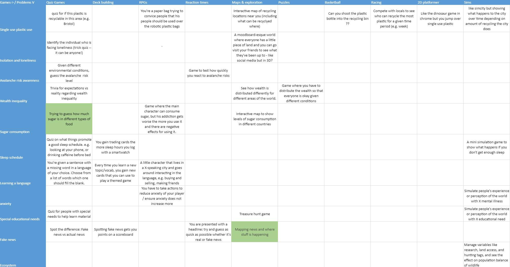
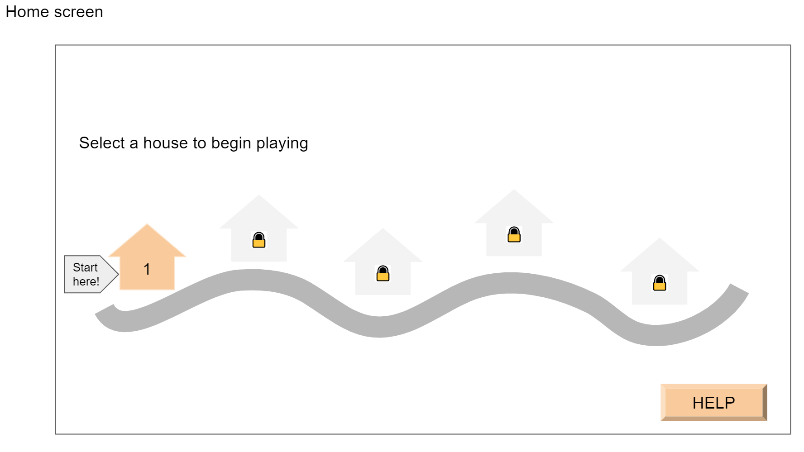
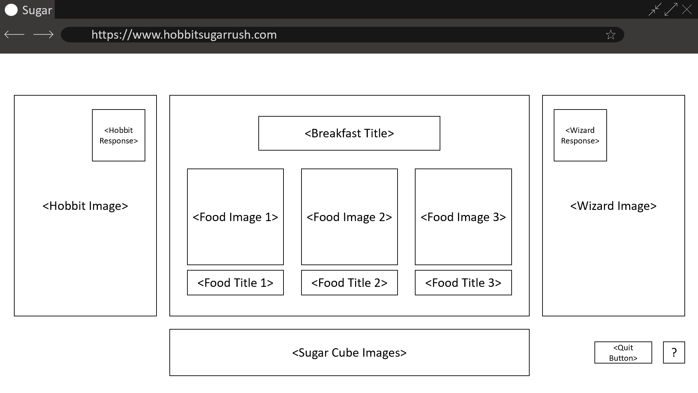
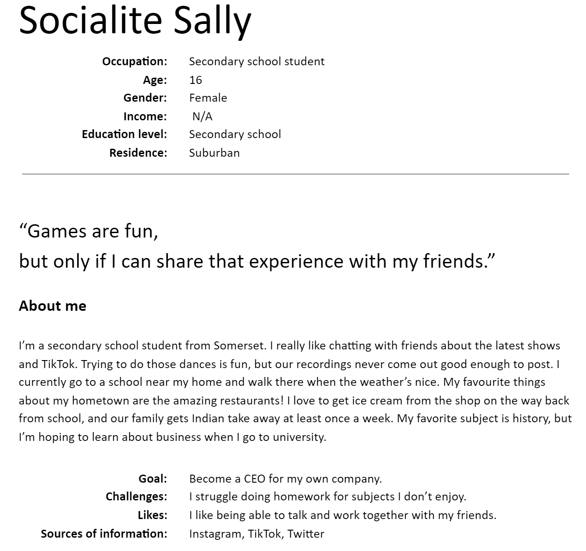
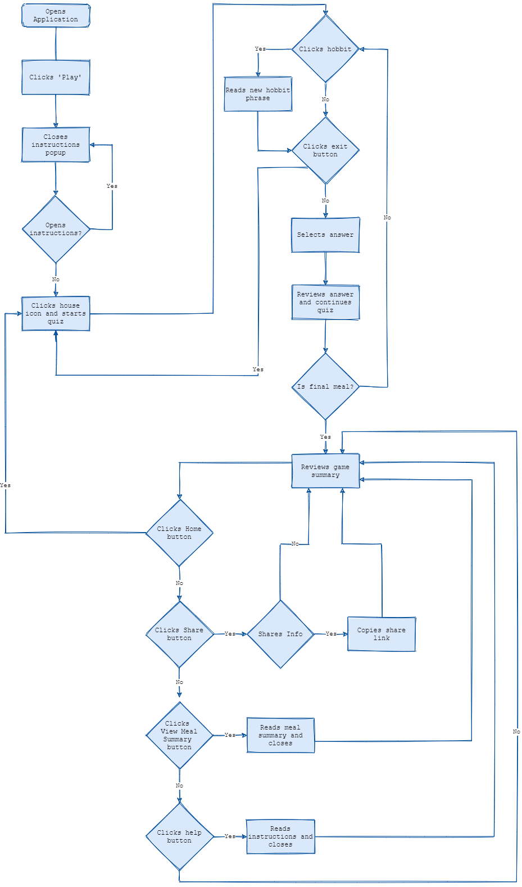

## 4 UX Design

* [4.1 Ideation](README.md#41-ideation)
* [4.2 User Groups](README.md#42-user-groups)
* [4.3 Design Heuristics](README.md#43-design-heuristics)
* [4.4 User Interviews](README.md#44-user-interviews)
* [4.5 Impact of Design](README.md#45-impact-of-design)

### 4.1 Ideation
To arrive at an idea for our project, we explored problems and potential solutions through the process of design thinking. Our ideation process began with a period of discovery where we determined ongoing societal problems and various game mechanics. We then created a chart to playful solutions to address these societal problems using the various game mechanics.  

We reviewed each of these solutions and determined which of these solutions were the most interesting through a group vote:
- Showing popular news trends around the world
- Quiz for sugar consumption.  

We began to develop these ideas into a potential application by writing project proposals for each [(click here to view)](../SugarRushProposal.pdf). When writing these proposals, we used group writing to help create a cohesive direction for the project. After completing the two briefs, we used another group vote to decide on the final project idea: Hobbit Sugar Rush. 

In our proposal, we identified awareness of sugar overconsumption as our primary goal and outlined the methods by which we would address it. During this process we made key decisions about the goals of our project:
  - Create a playful and educational experience
  - Use hobbits to encourage empathetic connection with sugar consumption
  - Quiz format of seven different hobbit meals based on Tolkien mythology
  - Sugar thresholds will be determined by NHS guidelines

Once we completed our project proposal, we created an initial ‘paper’ prototype [(click here to view)](https://docs.google.com/presentation/d/1PUFuL9rSekN_tIJ1nDB9tv86x6KvYPRJFryo8T6m-Vk/edit?usp=sharing) to represent the vision for the application. For this process, we used Google Slides. Each slide represented the layout and expected behaviour of the different website pages and components. 

This prototype helped us develop further features of the application.
  - Three food items per question in the food quiz
  - Hobbit having reactions to sugar content of foods
  - Wizard provides feedback on quiz answers (not implemented in MVP)
  - Graphical representation of sugar content, which provides a tangible representation of the amount of sugar in foods (see Sugar Stacks[[1]](README.md#references)).
  - User registration process
  - Initial quiz review or meal summary
  - Levels with progressively challenging hobbits that have different dietary needs

After we had developed our original idea into our initial prototype and proposal, we collected our thoughts and generated a final proposal and wireframe for the project.

Following additional discussions, we determined the following hypotheses will be evaluated for this project: 
- Allowing users to control sugar consumption through the medium of another being would raise more conscious awareness of sugar consumption.
- Allowing users to visualise sugar consumption with images would improve understanding of an amount of sugar in a food item.
- Playing the game will raise awareness about sugar consumption and the levels of sugar in certain foods.  

Throughout this process, we learned how to come up with an idea and hone in on the specifics to envision our product. However, evaluation became difficult due to lack of hypotheses in the beginning of our project. Developing them later helped further focus our goals and interviews. In order to improve our development in the future, we should strive to develop any hypotheses earlier in the design process, so we can incorporate them even more.

### 4.2 User Groups
We initially knew our product would be educational, so we had anticipated some of our user groups, such as children. As we developed our ideas and applications, we identified more potential users. In the broadest scope of our poject, we envisioned our application being playable by all. However, we focused on users we felt would be more likely to use our application:

- Children and teenagers
- University students
- Stable professionals  

Children and teenagers are likely to use the app if parents or schools encourage exploration of educational games, particularly those involving nutrition. This group could also be more likely to engage with social media trends. University students could be likely to engage with the game to learn more about nutrition, enjoy some fantasy references, or simply to explore an application created by other university students. Finally, stable professionals would be likely to engage with the game in their spare time and potentially discuss it with their friends and families, including children.

In addition to potential users, we also defined stakeholders as those who may play the game, but are particularly invested in how the game functions and affects its users. The two main stakeholder groups for our project were as follows:

- Parents
- Healthcare workers  

To appeal to parents, the educational intent of the game will need to be clear, and the content will need to be age appropriate. For healthcare workers, we will need to ensure the game displays accurate nutrition info and that the application does not negatively impact the health of those participating.

These user groups and stakeholders influenced the user personas and user stories used to power our group's project management.

### 4.3 Design Heuristics
As we progressed through the project, we needed to define our design methodology and heuristics. One of the main approaches for designing our software was ensuring a user-focused design. All design decisions needed to incorporate the user's perspective. Initially, we accomplished this by discussing design choices as a group. We eventually, we evolved to using persona-based user stories to accomplish this.

[Click here](personas.pdf) to see all of the personas we developed.

In addition to this design approach, we incorporate several design heuristics, which allowed us to have quick checks to ensure usability of our application. For this project, we derived design heuristics from Jakob Nielsen’s Ten Usability Heuristics[[2]](README.md#references). 

  - Aesthetic and minimal design
      - Definition: Content within site dialogue has only necessary information.
      - By keeping the website visually appealing and easy to navigate, users could focus on the intended experience we aimed to provide.
          - Minimal text on webpages to streamline user flows
          - Pictures instead of test where possible
          - Buttons over links for expected user actions
  - Consistency and standards
      - Definition: Site links and actions have similar names if a convention has already been established.
      - By using standard terminology on the site, users could navigate the website intuitively.
          - Button labeled 'Play' for players to enter the site
          - Popup labeled 'Instructions' that explain workflow to users when first opening the application
          - Button labeled 'Help' to help users find help
          - Button labeled 'Share' to indicate social media sharing
          - Share icons to indicate social media sharing for different social media platforms
          - Button labeled 'Close' to close modal windows
  - User control and freedom
      - Definition: Users have the option to quit actions they click by mistake or do not wish to complete.
      - Users would be able to return to the home screen or previous screen at any point in the the workflow.
          - Modal windows for instructions, meal summary, and sharing can be closed to return to the previous screen
          - Buttons from the quiz and game-end screens allow user to return to the home page (partially implemented)
          - In the initial wireframe, different exit workflows were available depending on whether a user was logged in or not.
  - Help and documentation 
      - Definition: Necessary help and instructions are easy to find. Any necessary steps are listed discretely and clearly.
      - During our design, we also incorporated ways for users to seek help if they needed additional guidance. 
          - Instructions are presented to users when they first enter the website
          - Instructions are a list of concise, discrete actions
  - Recognition rather than recall
      - Definition: Options are visible to the user, and instructions can be easily found.
      - By favouring interaction with buttons and graphics, users can intuitively understand and select options they desire.
          - Village and quiz screens have an instructions button to allow users to revisit instructions if they need help
          - Quiz answers can be selected by clicking either the food name or image
          - Buttons across the application are labeled with the action they perform rather than icons

Another element of design that we considered was the application’s responsiveness across multiple devices, such as mobile, laptop and tablet. This was driven by our desire for both clean aesthetics and accessibility - as our application’s target user base was broad, we felt that it was important to take into account a wide range of possible device preferences for gameplay. 

### 4.4 User Interviews
In order to further understand our user groups, we created an interview and a walkthrough of our prototype. For the interview we targeted university students and professionals. Due to the time allotted for this project and the inability to gain ethical approval prior to that time, we were unable to ask any minors for input on the prototype. We had a sample size n = 4, which is the minimum amount of people needed to perform in-depth interviews and usability studies[[3]](README.md#references). 

For the interview, we created a prototype that combined the design in our paper prototype with the structure and behaviour of our wireframe. The interview allowed us to gain insight into how users would use our application. It also gave us the opportunity to update our prototype to match these key pieces of feedback:
  - Users were not interested in registering user accounts for this type of application
  - The location and presentation of instructions was slightly confusing. Three of the four users made constructive comments about location and wording of instructions.
  - Users liked the concept of the game, but found the game lacking in challenge.
  - Users want clearer information about sugar content so it can be more educational.

Originally we included registration so users' progress through different levels could be stored persistently. Now, we have chosen to remove user registration and rely on website cookies to track a user’s progress. We also changed the delivery of instructions in the game. Automatic modal instructions appear when a user first accesses the site. Instructions are delivered via an optional modal window during the quiz. In the final version of the product, instructions will be provided via hobbit dialogue during the quiz. Buttons that provide instructions have been re-labeled to 'Instructions' to increase clarity of the button’s function. Finally, users were interested in learning more about the sugar content of food, so we have changed the sugar-cube icons to teaspoons to better represent sugar content. Originally, we planned to show the sugar content only for the selected food items. However, this choice masks the potential educational capabilities of the application. Now, we also will show the sugar content for all food items after each question. 

### 4.5 Impact of Design
Following our interviews with potential users, we were able to solidify the product we would develop. We created a final prototype [(click here to view)](WireframeForUserTestingFinal.pptx) that will be used for front-end development and guide any design choices. We created a final wireframe [(click here to view)](SEGPWireframe.pptx) that will serve as a guide to website behaviour and layout. The wireframe will help guide front-end and back-end development. Finally, using information we gathered from the interviews, we created a corresponding user flow diagram to guide how a user will step through the website. This tool helped guide website navigation and back-end development.

### Appendix
1. [Initial project proposals](../SugarRushProposal.pdf)
2. [Paper prototype](https://docs.google.com/presentation/d/1PUFuL9rSekN_tIJ1nDB9tv86x6KvYPRJFryo8T6m-Vk/edit?usp=sharing)
3. [Personas](personas.pdf)
4. [Final Prototype](WireframeForUserTestingFinal.pptx)
5. [Final Wireframe](SEGPWireframe.pptx)

### References
1. Sugar Stacks - How Much Sugar Is in That? - http://www.sugarstacks.com/
2. Heuristic Evaluation - Ten Usability Heuristics - by Jakob Nielsen - https://pdfs.semanticscholar.org/5f03/b251093aee730ab9772db2e1a8a7eb8522cb.pdf
3. Plan user research for your service - Service Manual - GOV.UK - https://www.gov.uk/service-manual/user-research/plan-user-research-for-your-service

[Previous Section](/SystemImplementation/README.md) | [Home](../README.md) | [Next Section](/SprintsAndProjectManagement/README.md)
